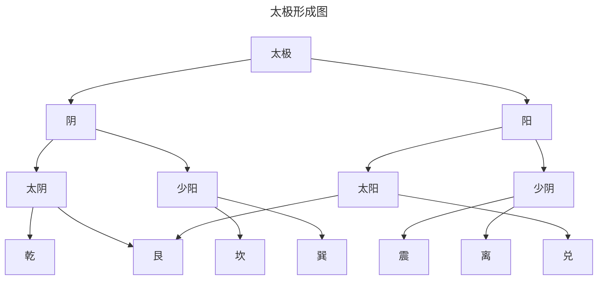

## 1.阴阳起源

传统八卦被认为是周易八卦
八卦指的是八个基本卦

| 卦名  | 乾   | 坤   | 震   | 巽   |
|:---:|:---:|:---:|:---:|:---:|
| 卦体  | ☰   | ☷   | ☳   | ☴   |
| 象征  | 天   | 地   | 雷   | 风   |
| 家庭  | 父   | 母   | 长男  | 长女  |

| 卦名  | 坎   | 离   | 艮   | 兑   |
|:---:|:---:|:---:|:---:|:---:|
| 卦体  | ☵   | ☲   | ☶   | ☳   |
| 象征  | 水   | 火   | 山   | 泽   |
| 家庭  | 中男  | 中女  | 少男  | 少女  |

而从道家学派的《老子》描绘万物从而描绘除阴阳

::: info 道生一，一生二，二生三，三生万物。

道所生出的“一”，是未分阴阳的混沌世界

“二”便是天地，便是阴阳。

“二生三”，是指天地交合，阴阳二气相互激荡而生成冲气，即和气。

“三生万物”，就是和气通过不同的途径形成了天下万物。

故万物有阴阳，万物都是阴阳之和。
:::
而阴阳成了《周易》的核心思想
那为什么周易在西周所著为什么在东周的战国阴阳成为周易的核心思想呢？
原因是周易分为经合传，经是占卜，传是易传。

易传采用阴阳的说法。
但它认为阴阳不仅是一种气，而是事物的属性，每个事物都有阴阳的属性

既有天就有地，有雷就有风，有水就有火等

## 2.卦气说

所谓封气说，就是利用《周易》的卦交象，来解说一年节气的变化。具体地讲，就是将《周易》的卦象，按照一定的规律，与四时、十二月、二十四节气、七十二候等有机地结合起来，形成一套独有的理论。

| 季节  |     | 春   |     |     | 夏   |     |
|:---:|:---:|:---:|:---:|:---:|:---:|:---:|
| 月份  | 一   | 二   | 三   | 四   | 五   | 六   |
| 节气  | 立春  | 惊蛰  | 清明  | 立夏  | 芒种  | 小暑  |
| 中气  | 雨水  | 春分  | 谷雨  | 小满  | 夏至  | 大暑  |
| 卦象  | 泰   | 大壮  | 央   | 乾   | 姤   | 遁   |

| 季节  |     | 秋   |     |     | 冬   |     |
|:---:|:---:|:---:|:---:|:---:|:---:|:---:|
| 月份  | 七   | 八   | 九   | 十   | 十一  | 十二  |
| 节气  | 立秋  | 白露  | 寒露  | 立冬  | 大雪  | 小寒  |
| 中气  | 处暑  | 秋分  | 霜降  | 小雪  | 冬至  | 大寒  |
| 卦象  | 否   | 观   | 剥   | 坤   | 复   | 临   |

## 3.五行起源

::: info 五方观念
已已，王卜，贞今岁商受年。王占日：吉。
东土受年。
南土受年。
西土爱年。
北土受年。
:::
五方观念最早出自殷商
又有五臣、五火等所以殷人尚五的传统
以方位为基础的五的体系，为五行说的原始来源

::: info 洪范五行
五行：一日水，二日火，三日木，四日金，五日士。水日润下，火日炎上，木日曲
直，金回从草，土口琼鹅。润下作成，炎上作苦，曲直作酸，从整作辛，称稿作计
:::
此五行是指五种基本的生产活动
又到我们熟悉的战国时期，阴阳家讲五行融合了起来
五行就不再是五种事物，而是五种元素，五种相互联系
故有
::: info 五行相生相克
相生：木->火->土->金->水
相克: 水->火->金->木->土

|     | 金   | 木   | 水   | 火   | 土   |
| --- |:---:|:---:|:---:|:---:|:---:|
| 相生  | 水   | 火   | 木   | 土   | 金   |
| 相克  | 木   | 土   | 火   | 金   | 水   |

:::
在《管子》里，阴阳是宇宙的本源
这也是早期弹阴阳五行融合的著作
::: details 《管子 ·四时》
是故阴阳者，天地之大理也，四时者，阴阳之大经也。

东方曰星，其时曰春。其气曰风，风生木与骨

南方曰日，其时曰夏，其气曰阳，阳生火与气

中央曰土，土德实辅四时入出，以风雨节土益力，土生皮肌肤

西方曰辰，其时曰秋，其气曰阴，阴生金与甲

北方曰月，其时曰冬，其气曰寒，寒生水与血
:::
到了而西汉初年的《淮南子》中的《天文训》中,
则以方位（空间）作为世界的框架，以天地相应、天人相应为主要的联系方式。
::: details 《淮南子·天文训》
天地之袭精为阴阳，阴阳之专精为四时，四时之散精为万物。

积阳之热气生火，火气之精者为日；

积阴之寒气为水，水气之精者为月；

日月之淫为精者为星辰，天受日月星辰，地受水潦尘埃。
:::
到了西汉的董仲舒的《春秋繁露》吸取了战国以来的阴阳五行思想，进一步用阴阳五行来揭示事物发展的规律。他认为，五行关系是社会伦理关系从而进一步提出阳尊阴卑之说,这样让阳占了主导地位。所以儒学也将阴阳五行融入思想是有一定道理的。

## 4.五运六气起源

到了秦汉时期，就是中医理论的建立。《黄帝内经》就是其代表作。

| 五行  | 木   | 火   | 土   | 金   | 水   |
|:--- |:---:|:---:|:---:|:---:|:---:|
| 五色  | 青   | 赤   | 黄   | 白   | 黑   |
| 五味  | 酸   | 苦   | 甘   | 辛   | 咸   |
| 五气  | 风   | 暑   | 湿   | 燥   | 寒   |
| 时序  | 春   | 夏   | 长夏  | 秋   | 东   |
| 生化  | 生   | 长   | 化   | 收   | 藏   |
| 五方  | 东   | 南   | 中   | 西   | 北   |

| 五行  | 木   | 火   | 土   | 金   | 水   |
|:--- |:---:|:---:|:---:|:---:|:---:|
| 五脏  | 肝   | 心   | 脾   | 肺   | 肾   |
| 五腑  | 肝   | 小肠  | 胃   | 大肠  | 膀胱  |
| 五体  | 筋   | 脉   | 肉   | 皮   | 骨   |
| 五官  | 目   | 舌   | 口   | 鼻   | 耳   |
| 五志  | 怒   | 喜   | 思   | 忧   | 恐   |
| 五声  | 呼   | 笑   | 歌   | 苦   | 呻   |

此思想是"人与天地相参也，与日月相应也。"，也就是所谓的天人感应，既天、地、人、相参的宇宙和谐思想。在探讨自然界规律时，提出了五运六气之说。
该学说认为每一年都有自己的气象特点，之间的差异是由五运和六气的相互作用产生，从而构成了六十年的循环周期。

人与天地相应的原则，这自然气候的变化，自然影响到人体的健康和疾病。
如果不适应年气候的异常变化，人体就会发生跟气候变化特点相关的流行病。

比如，岁木太过，风行，牌土受邪；岁火太过，严暑流行，肺金受邪。
::: info 五运六气系统
天地之问存在两大气象要素系统
一为五运系统，由木、火、土、金、水五气构成，按五行结构法测组织起来，称为五运：

一为三阴三阳系统，由风、热、火、湿、燥、寒六气构成，

或者按三阴三阳（即少阴、太阴、展阴、少阳、太阳、阳明）的组织法则组织起来，称为六气。
:::
::: details 五运六气系统补充
五运内部有分大运、主运和客运。
大运即主管每年全年的岁运；
主运指每年五个运季的一般常规变化：
客运指每年五个运季中的特殊变化。
六气内部又分主气和客气。
主气和主运基本意义相同，也指每年各个季节气侯的一般常规交化：
客气是各年气侯上的异常变化。根据五运和六气两大系统之间及其内部发生相生相胜、相吸相斥的交互作用，在许多因素的自然综合过程中，形成六十种年气象类型
:::
五运六气根据天干地支的阴阳五行从而推算出来
那么干支到底是什么呢？

## 5.干支起源

天干、地支统称为干支，相传是黄帝时代就创立。干支本质的意义指树干和树枝。故支又称枝。
::: info 天干地支起源
干，古最初用来记日。每天的计算以日出、日没为准，日出一次就是天，所以干又叫天干。
支，最初用来记月。每一个月是用月亮的盈亏来计算。月亮盈亏一次，就是一月。
从阴阳属性上看，日为阳，月为阴，阳为天，阴为地，所以支又叫地支。
:::

天干有十个，依次为甲、乙、丙、丁、戊、已、庚、辛、壬、癸。
地支有十二位，依次为子、丑、寅、卯、辰、已、午、未、申、酉、壬、癸
用地支来记月，一年十二个月正好跟十二个地支相配
正月建寅，卯为二月，辰为三月，已为四月，午为五月，未为六月，申为七月，酉为八月，壬为九月，癸为十月，子为十一月，丑为二月。
为什么寅是正月，这里是据周朝建立是以十一月为岁首，定正月从汉武帝开始。
::: info 三证论
相传夏历正月建寅，商历正月建丑。周历正月建子这是所调“三正论”。最早见于《左传》，
《史记·历书》。但争议比较大，也有可能是春秋战国时期不同地域的历日制度。
:::
根据天干和地支的相互组合从而产生了干支纪日法，也就甲子纪日法。以六十为一个甲子。
当然又到了战国的《管子》的五行，和《吕氏春秋》的十二纪以及汉的《淮南子》的北斗斗柄。
这里不再赘述，感兴趣可以看古籍。

| 天干  | 甲\|乙 | 丙\|丁 | 戊\|己 | 庚\|辛 | 壬\|癸 |
|:---:|:----:|:----:|:----:|:----:|:----:|
| 阴阳  | +\|- | +\|- | +\|- | +\|- | +\|- |
| 五行  | 木    | 火    | 土    | 金    | 水    |
| 方位  | 东    | 南    | 中    | 西    | 北    |

| 地支  | 寅\|卯\|辰     | 己\|午\|未     | 申\|酉\|戊     | 亥\|子\|丑     |
|:---:|:-----------:|:-----------:|:-----------:|:-----------:|
| 阴阳  | + \| - \| + | - \| + \| - | + \| - \| + | - \| + \| - |
| 五行  | 木   \| 土    | 火   \|土     | 金   \|土     | 水    \|土    |
| 方位  | 东           | 南           | 西           | 北           |
| 四时  | 春           | 夏           | 秋           | 冬           |
| 月份  | 正\|二\|三     | 四\|五\|六     | 七\|八\|九     | 十\|十一\|十二   |

::: warning 注意

四柱年的分割是以二十四节气未首的立春为日时为一年的交换之点，而不是农历所标记的月份，从而避免公里大小月和农历的置闰问题

:::

值得注意的是，二十四节气都是根据古代中国的天文从而演变过来，中国处于北半球。地球自转，同时围着太阳共转。但地球自转的轴线并不垂直于它的公转轨道面，它是倾斜的，成23°27的倾角，即赤道圈跟黄道图之间有这么一个黄赤交角。这个交角正是产生二至（冬至、夏至）二分（春分、秋分）的原因。太阳正照北回归线时，则为夏至，对
身居北半球的人来说，这是日照最长的一天；太阳正照南回归线时，则为冬至。
基于这点去算其他地区的人往往是不准的。除非另外建立模型进行计算。
而当时我们所处的地方范围呢？

根据《尚书·禹贡》提出的九州概念
既翼州、青州、徐州、扬州、荆州、豫州、梁州、雍州。

《吕氏春秋》又有详细的解释
::: details 《吕氏春秋·有始览·有始》 
何谓九州？

河、汉之间为豫州，周也。

两河之间为冀州，晋也。

河、济之间为兖州，卫也。

东方为青州，齐也。

泗上为徐州，鲁也。

东南为扬州，越也。

南方为荆州，楚也。

西方为雍州，秦也。

北方为幽州，燕也。
:::
这个区域大致包括燕山山脉以南，五岭以北，西及青藏高原，东到海岸线的广大地区。面积约300万平方公里。
根据地域及其生态的基本状况，古代做出了地有五行的描述，既五行

| 木   | 春   | 东方  | 风   |
|:---:|:---:|:---:|:---:|
| 火   | 夏   | 南方  | 暑   |
| 土   | 长夏  | 中央  | 湿   |
| 金   | 秋   | 西方  | 燥   |
| 水   | 冬   | 北方  | 寒   |

这里的中央，指豫州。既河南一带，原因是是商朝殷墟所在地。

从那时开始隋唐、北宋都在中原徘徊，即长安、洛阳、开封。

以河南为中心将南北以火—夏—南方—暑和水—东—北方—寒为匹配

而历年来有天不足西北和地不满东南一说。具体而言，在中国季风气候下，西北气压高于东南，冬季风一直推移到东南沿海.

中国地势是西高东低。山脉多东西走向，河流也东西走向。东部沿海，降雨量充沛，西部内陆干燥，降雨量稀少。所以又将东和木、西和金联系在一起了。

以中原为例

| 风     | 热     | 暑     | 湿     | 燥     | 寒     |
|:-----:|:-----:|:-----:|:-----:|:-----:|:-----:|
| 大寒-春分 | 春分-小满 | 小满-大暑 | 大暑-秋分 | 秋分-小雪 | 小雪-大寒 |
| 风沙大作  | 气候湿润  | 气候炎热  | 黄梅雨季  | 气候凉爽  | 寒冷干燥  |

六可归五，因为暑以热为主。

::: details 《黄帝内经·素问 天元纪大论》

天有五行，御五位以生寒暑燥湿风

:::

作为干支符号的完备和使用，始于东汉元和二年的四分历，这里就不用表格构建了。命理学的研究必然是东汉之后

