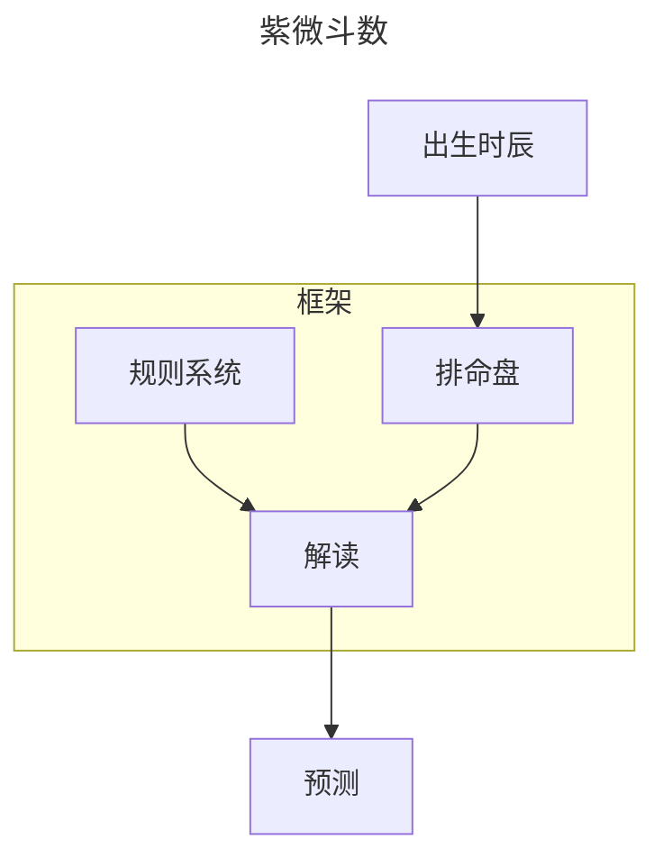
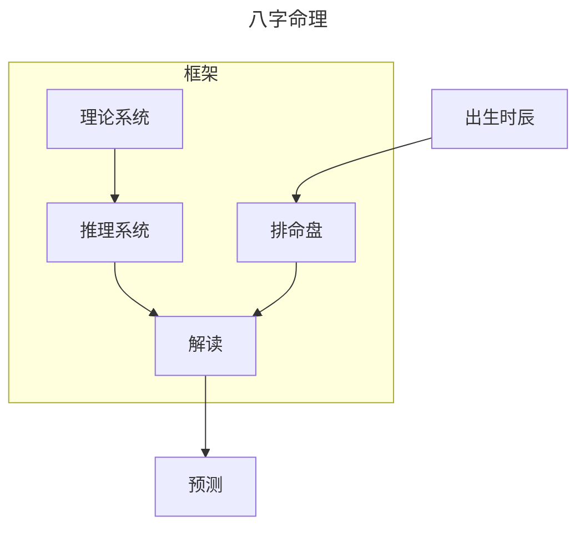

## 1.流派起源

什么是传统命理学？以一个人的出生时间推算方法为八字命理学和紫微斗数。
紫微斗数产生在北宋时代，跟八字命理学的形成，差不多是在同一个时期。
紫微斗数的前身是十八飞星。再追湖上去，是古代的五星术，也称七政四余。
所以紫微斗数实际上是占星学，跟国外的占星术实际上是一样的。
严格来讲两者皆为术数，但八字命理学形成了一套自己独有的逻辑，所以这里着重讲八字以及衍伸。

## 2.什么是八字

那么，什么是八字呢？
由年天干、地支的两个字，月天干、地支的两个字，日天干、地支的两个字和时天干、地支的两个字，共八个字组成。
按传统的习惯写法，年、月、日、时的天干地支呈竖式从右书写，因此也称"四柱"。
八字的基本结构如下：

| 时   | 日   | 月   | 年   |     |
|:---:|:---:|:---:|:---:|:---:|
|     |     |     |     | 天干  |
|     |     |     |     | 地支  |

::: details 命盘排盘
如果一个人出生在2023年8月31日14时45分
那么他的八字是
癸卯　　　庚申　　　辛酉　　　乙未

那么他的结构如下

| 时   | 日   | 月   | 年   |     |
|:---:|:---:|:---:|:---:|:---:|
| 乙   | 辛   | 庚   | 癸   | 天干  |
| 未   | 酉   | 申   | 卯   | 地支  |

:::

## 3.先天还是后天

所以在这一逻辑里，我们可以理解成这样一个概念

```state
个人 --> 出生时间
出生时间 --> 潜质和人生经历 : 相互对应
```

影响一个人的成长和发展的因素很多。但是有先天条件可以决定人的一生
比如说基因,所以我们不能既忽视先天也不能忽视后天
所谓的后天指家庭、教育、政治、经济制度等等
而细分的话则为
一、地理环境。二、种族差异。三、风俗习尚。
四、政治制度。五、先人门风。六、教育程度。
七、品德修为。八、体格相貌。九、突发异变。

所以如果做命理推算不光是要考虑先天还要考虑后天条件
这里的后天条件包括国运，在危难关头，个人的命运就显的没那么重要了。

## 4.同年同日的命运解析

世界上有不少同年同月同日同时生的人，他们的命运难道会完全相同吗？
三命通会其实也有说明，《三命通会》卷 六·十干十二年生大贵人例中
余纪缙绅与凡民，命同者不能悉数。有说明
所以算命不可能是百分百正确，但大多相当。
即使放在现代的大数据，也只可能是99.9%的正确率，不可能做到100%

## 5.命理推算算法解析

古人分为早子时和晚子时
那么一天有十三个时辰

| 早子  | 凌晨  | 0-1   |
|:---:|:---:| ----- |
| 丑   |     | 1-3   |
| 寅   |     | 3-5   |
| 卯   | 上午  | 5-7   |
| 辰   |     | 7-9   |
| 已   |     | 9-11  |
| 午   | 中午  | 11-13 |
| 未   |     | 13-15 |
| 申   |     | 15-17 |
| 酉   | 下午  | 17-19 |
| 戌   |     | 19-21 |
| 亥   |     | 21-23 |
| 夜子  | 半夜  | 23-24 |

天干有
甲、乙、丙、丁、戊、己、庚、辛、壬、癸

地支有
子、丑、寅、卯、辰、巳、午、未、申、酉、戌、亥

十个天干和十二个地支顺序组合，自甲子始，至癸亥终，天干循环六次，地支循环五次。
共有六十个组合，称为六十甲子 既

| 01 甲子 | 11甲戌  | 21甲申  | 31 甲午 | 41甲辰  | 51甲寅  |
| ----- | ----- | ----- | ----- | ----- | ----- |
| 02 乙丑 | 12 乙亥 | 22乙酉  | 32 乙未 | 42乙巳  | 52 乙卯 |
| 03 丙寅 | 13丙子  | 23 丙戌 | 33丙申  | 43丙午  | 53丙辰  |
| 04丁卯  | 14丁丑  | 24丁亥  | 34丁酉  | 44丁未  | 54丁巳  |
| 05戊辰  | 15戊寅  | 25戊子  | 35戊戌  | 45戊申  | 55 戊午 |
| 06己巳  | 16己卯  | 26己丑  | 36 己亥 | 46 己酉 | 56 己未 |
| 07庚午  | 17 庚辰 | 27庚寅  | 37 庚子 | 47 庚戌 | 57 庚申 |
| 08辛未  | 18 辛巳 | 28 辛卯 | 38 辛丑 | 48 辛亥 | 58 辛酉 |
| 09壬申  | 19壬午  | 29 壬辰 | 39 壬寅 | 49 壬子 | 59 壬戌 |
| 10癸酉  | 20癸未  | 30 癸巳 | 40 癸卯 | 50 癸丑 | 60 癸亥 |

所以有八字结构为

| 时   | 日   | 月   | 年   |        |
|:---:|:---:|:---:|:---:| ------ |
|     |     |     |     | 天干     |
|     |     |     |     | 地支     |
| 13  | 60  | 12  | 60  | 561600 |

又分男女，以这个系数乘2 既得112.32万个男命女命

不难看出数据集有100万个

按照类的方法去分那么每个属科目纲门的每一个种类都有所不同

相对于现代的大量数据集，从概率上讲已经不够用了，所以准确率比现代的大数据低也是有一定道理的

## 6.紫微斗数和八字的区别

紫微斗数是通过星盘的十二宫按照规则进行解读和推算，再按照合冲等规则让其本质发生改变从而进行推算

这里有个流程图可以进行理解



通过紫微斗数的规则解读排出来的星盘上的星耀的位置合组合的意义，从而推断除结果。

那么八字的流程是怎么样的呢



具备完整的理论模型和一整套的推理系统，它已经超越了仅仅总结经验规则的那个层面。
