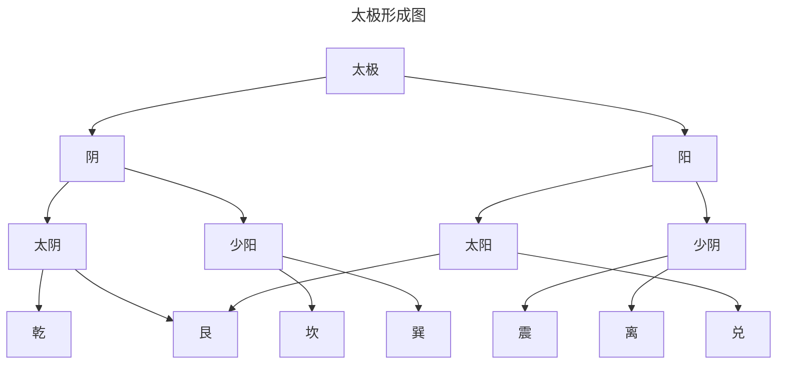

## 1.阴阳起源

传统八卦被认为是周易八卦
八卦指的是八个基本卦

| 卦名  | 乾   | 坤   | 震   | 巽   |
|:---:|:---:|:---:|:---:|:---:|
| 卦体  | ☰   | ☷   | ☳   | ☴   |
| 象征  | 天   | 地   | 雷   | 风   |
| 家庭  | 父   | 母   | 长男  | 长女  |

| 卦名  | 坎   | 离   | 艮   | 兑   |
|:---:|:---:|:---:|:---:|:---:|
| 卦体  | ☵   | ☲   | ☶   | ☳   |
| 象征  | 水   | 火   | 山   | 泽   |
| 家庭  | 中男  | 中女  | 少男  | 少女  |

而从道家学派的《老子》描绘万物从而描绘除阴阳

::: info 道生一，一生二，二生三，三生万物。

道所生出的“一”，是未分阴阳的混沌世界
“二”便是天地，便是阴阳。
“二生三”，是指天地交合，阴阳二气相互激荡而生成冲气，即和气。
“三生万物”，就是和气通过不同的途径形成了天下万物。
故万物有阴阳，万物都是阴阳之和。
:::
而阴阳成了《周易》的核心思想
那为什么周易在西周所著为什么在东周的战国阴阳成为周易的核心思想呢？
原因是周易分为经合传，经是占卜，传是易传。
易传采用阴阳的说法。
但它认为阴阳不仅是一种气，而是事物的属性，每个事物都有阴阳的属性

既有天就有地，有雷就有风，有水就有火等

## 2.卦气说

所谓封气说，就是利用《周易》的卦交象，来解说一年节气的变化。具体地讲，就是将《周易》的卦象，按照一定的规律，与四时、十二月、二十四节气、七十二候等有机地结合起来，形成一套独有的理论。

| 季节  |     | 春   |     |
|:---:|:---:|:---:|:---:|
| 月份  | 一   | 二   | 三   |
| 节气  | 立春  | 惊蛰  | 清明  |
| 中气  | 雨水  | 春分  | 谷雨  |
| 卦象  | 泰   | 大壮  | 央   |

| 季节  |     | 夏   |     |
|:---:|:---:|:---:|:---:|
| 月份  | 四   | 五   | 六   |
| 节气  | 立夏  | 芒种  | 小暑  |
| 中气  | 小满  | 夏至  | 大暑  |
| 卦象  | 乾   | 姤   | 遁   |

| 季节  |     | 秋   |     |
|:---:|:---:|:---:|:---:|
| 月份  | 七   | 八   | 九   |
| 节气  | 立秋  | 白露  | 寒露  |
| 中气  | 处暑  | 秋分  | 霜降  |
| 卦象  | 否   | 观   | 剥   |

| 季节  |     | 冬   |     |
|:---:|:---:|:---:|:---:|
| 月份  | 十   | 十一  | 十二  |
| 节气  | 立冬  | 大雪  | 小寒  |
| 中气  | 小雪  | 冬至  | 大寒  |
| 卦象  | 坤   | 复   | 临   |

## 3.五行起源

::: info 五方观念
已已，王卜，贞今岁商受年。王占日：吉。
东土受年。
南土受年。
西土爱年。
北土受年。
:::
五方观念最早出自殷商
又有五臣、五火等所以殷人尚五的传统
以方位为基础的五的体系，为五行说的原始来源

::: info 洪范五行
五行：一日水，二日火，三日木，四日金，五日士。水日润下，火日炎上，木日曲
直，金回从草，土口琼鹅。润下作成，炎上作苦，曲直作酸，从整作辛，称稿作计
:::
此五行是指五种基本的生产活动
又到我们熟悉的战国时期，阴阳家讲五行融合了起来
五行就不再是五种事物，而是五种元素，五种相互联系
故有
::: info 五行相生相克
相生：木->火->土->金->水
相克: 水->火->金->木->土
:::
在《管子》里，阴阳是宇宙的本源
这也是早期弹阴阳五行融合的著作
::: details 《管子 ·四时》
是故阴阳者，天地之大理也，四时者，阴阳之大经也。
东方曰星，其时曰春。其气曰风，风生木与骨
南方曰日，其时曰夏，其气曰阳，阳生火与气
中央曰土，土德实辅四时入出，以风雨节土益力，土生皮肌肤
西方曰辰，其时曰秋，其气曰阴，阴生金与甲
北方曰月，其时曰冬，其气曰寒，寒生水与血
:::
到了而西汉初年的《淮南子》中的《天文训》中,
则以方位（空间）作为世界的框架，以天地相应、天人相应为主要的联系方式。
::: details《淮南子·天文训》
天地之袭精为阴阳，阴阳之专精为四时，四时之散精为万物。积阳之热气生火，火气之精者为日；积阴之寒气为水，水气之精者为月；日月之淫为精者为星辰，天受日月星辰，地受水潦尘埃。
:::
到了西汉的董仲舒的《春秋繁露》吸取了战国以来的阴阳五行思想，进一步用阴阳五行来揭示事物发展的规律。他认为，五行关系是社会伦理关系从而进一步提出阳尊阴卑之说
